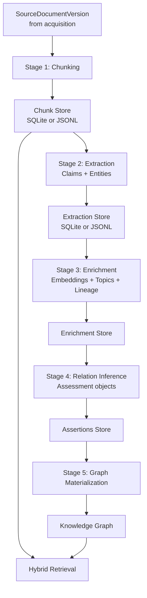
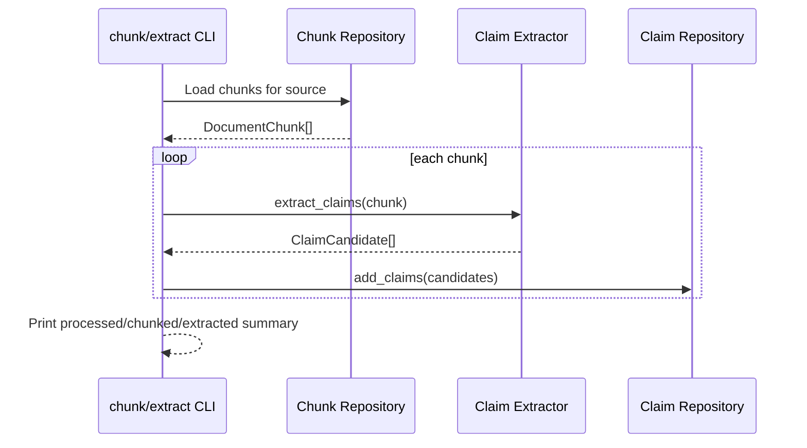

# Analysis Pipeline

This document is the working blueprint for turning acquired policy documents into auditable analysis artifacts and, later, a knowledge graph.

It captures:

- what exists now,
- what each stage should do,
- data contracts between stages,
- where complexity lives,
- and the recommended place to start next.

## 1) Scope and intent

The acquisition context gives us source document versions with strong provenance.

The analysis context builds on that by producing:

- deterministic document chunks,
- extracted claims and entities,
- enrichment metadata (embeddings, topics, lineage),
- relationship assertions (`supports`, `contradicts`, etc.),
- graph-ready structures for policy influence queries.

## 2) Current status snapshot

Implemented:

- deterministic chunking (`chunk_id`, offsets, version binding),
- chunk persistence in SQLite and JSONL,
- basic `chunk` CLI command.

Not implemented yet:

- claim extraction,
- entity extraction,
- enrichment layer,
- relation inference,
- graph materialization.

## 3) End-to-end architecture

## 4) Why hybrid (embeddings + graph)

Embeddings and graphs solve different problems:

- embeddings: semantic recall and similarity search,
- graph: explicit domain relationships and explainable multi-hop queries.

Recommended pattern:

1. use embeddings to retrieve candidate chunks,
2. use graph assertions to represent and query policy influence with evidence.

## 5) Stage-by-stage contracts

### Stage 0: Input from acquisition

Input object: `SourceDocumentVersion`

Required fields:

- `source_id`
- `source_document_id`
- `source_url`
- `checksum`
- `normalized_text`
- `published_at`, `retrieved_at`
- `raw_content_ref`

Invariant:

- Downstream artifacts must bind to document version identity (`source_document_id` + `checksum`).

### Stage 1: Chunking

Purpose:

- Split `normalized_text` into deterministic overlapping chunks.

Output object: `DocumentChunk`

- `chunk_id`
- `source_id`
- `source_document_id`
- `document_checksum`
- `chunk_index`
- `start_char`, `end_char`
- `chunk_text`

Status:

- Implemented.

Main risks:

- over-fragmented or semantically awkward boundaries,
- overly large chunk sizes reducing extraction precision.

### Stage 2: Extraction (claims + entities)

Purpose:

- Convert chunk text into structured claim and entity candidates with spans.

Claim extraction v1 recommendation:

- non-LLM first (sentence segmentation + rules/lexical features),
- deterministic confidence scoring,
- required evidence spans.

Entity extraction v1 recommendation:

- rule patterns + dictionaries,
- optional lightweight NER adapter later.

Output objects:

- `ClaimCandidate`
- `EntityMention`

Required fields for both:

- `chunk_id`
- `source_document_id`
- `document_checksum`
- `start_char`, `end_char`
- `confidence`
- `extractor_version`

### Stage 3: Enrichment

Purpose:

- Add retrieval and interpretation metadata.

Candidate outputs:

- chunk embeddings,
- topic tags,
- optional doc embeddings,
- lineage metadata (model/version/run).

Note:

- keep enrichment separate so extraction can stay deterministic.

### Stage 4: Relation inference

Purpose:

- Assess claim stance against policy targets.

Recommended object: `Assessment`

- `assessment_id`
- `claim_id`
- `policy_id`
- `stance`: `supports | contradicts | neutral | mixed | insufficient_evidence`
- `confidence`
- `rationale`
- `evidence_chunk_ids`
- lineage metadata.

Hard rule:

- no non-neutral assessment without evidence chunks.

### Stage 5: Graph materialization

Purpose:

- Upsert auditable graph nodes/edges from assertions.

Core nodes:

- `Document`, `Chunk`, `Claim`, `Policy`, `Assessment`, `Entity`, `Topic`, `Source`.

Core edges:

- `Document -[:HAS_CHUNK]-> Chunk`
- `Chunk -[:ASSERTS]-> Claim`
- `Claim -[:ASSESSED_AGAINST]-> Assessment`
- `Assessment -[:TARGETS]-> Policy`
- `Assessment -[:EVIDENCED_BY]-> Chunk`

### Stage 6: Serving

Purpose:

- Provide analyst workflows and query recipes.

Pattern:

- vector retrieval for recall,
- graph traversal for explanation and relationship reasoning.

## 6) Data lineage and auditability requirements

Every stage output should include:

- source linkage (`source_id`, `source_document_id`),
- version linkage (`document_checksum`),
- local evidence offsets (`start_char`, `end_char`),
- extraction lineage (`extractor_version`, run timestamp),
- confidence score and optional rationale.

## 7) Query families we are designing for

- Which policies have the highest contradiction volume by timeframe?
- What is the strongest evidence for and against a target policy?
- Which organizations are repeatedly associated with claims on a topic?
- How framing differs by source (`australia_institute` vs `lowy_institute`)?
- Which claims shift stance over time for the same policy?

## 8) Complexity map (where effort is highest)

Low complexity:

- chunk persistence,
- extraction persistence,
- CLI orchestration.

Medium complexity:

- deterministic claim extraction heuristics,
- entity mention extraction and span alignment,
- topic tagging and embedding pipeline.

High complexity:

- robust policy target resolution,
- stance inference quality and calibration,
- entity canonicalization and dedup,
- graph consistency over re-runs and version drift.

## 9) Recommended place to start now

Start with **claim extraction v1 (non-LLM)**.

Reasoning:

- directly supports policy influence goals,
- can run immediately on existing chunks,
- deterministic and testable with small fixtures,
- keeps optional LLM enhancement for later.

First thin slice:

1. add `ClaimCandidate` model,
2. sentence segmentation + rule-based claim detector,
3. persist claims to SQLite/JSONL,
4. add `extract-claims` CLI command,
5. add gold fixture tests for precision/recall sanity.

## 10) Sequence diagram for the next slice

